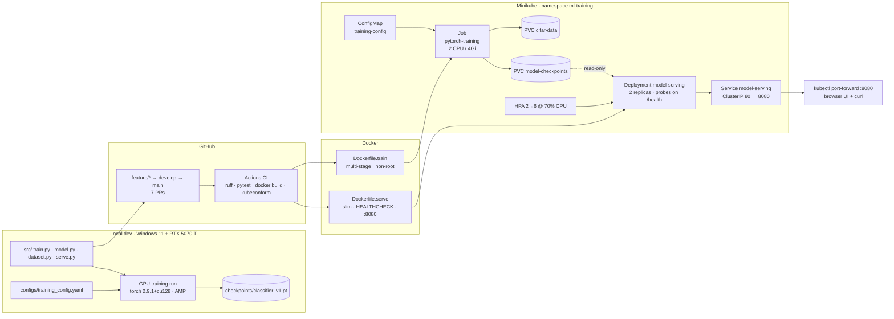

# mlops-pytorch-pipeline

CIFAR-10 image classification taken through the full deployment lifecycle: local
GPU training on an RTX 5070 Ti, containerised training and serving with Docker,
and orchestration on a local Minikube cluster (Job + PVC + ConfigMap +
Deployment + Service + HPA).

| | |
|---|---|
| Model | ResNet-18, CIFAR-adapted stem (3×3 stride-1 conv, no maxpool) |
| Dataset | CIFAR-10, 50k train / 10k test |
| Training | Adam + cosine schedule, AMP (fp16), early stopping, JSON-lines logs |
| Serving | Flask + gunicorn, `POST /predict`, `GET /health`, browser UI |
| Orchestration | Minikube (Docker driver) on Windows 11 |
| GPU | NVIDIA RTX 5070 Ti Laptop (Blackwell, sm_120) — PyTorch 2.9.1+cu128 |

---

## Architecture

Interactive version: open **[`docs/architecture.html`](docs/architecture.html)**
in a browser (click any node for its files, commands and ports).



---

## Repository layout

```
mlops-pytorch-pipeline/
├── README.md
├── .gitignore / .dockerignore / .env.example
├── pyproject.toml                  ruff + pytest config
├── .github/workflows/ci.yml        lint · tests · image builds · manifest validation
├── src/
│   ├── model.py                    ResNet-18 (CIFAR stem) + SimpleCNN factory
│   ├── dataset.py                  transforms, dataloaders, inference transform
│   ├── train.py                    config-driven training loop, JSON logs, early stop
│   ├── serve.py                    Flask app: /predict, /health, /info, sample gallery
│   └── templates/index.html        two-mode UI (random test image | upload)
├── configs/training_config.yaml
├── docker/Dockerfile.train         multi-stage, venv-copy, non-root
├── docker/Dockerfile.serve         inference-only deps, HEALTHCHECK, EXPOSE 8080
├── k8s/
│   ├── namespace.yaml  configmap.yaml  secret.example.yaml  pvc.yaml
│   ├── training-job.yaml  training-job-gpu.yaml
│   └── serving-deployment.yaml  serving-service.yaml  hpa.yaml
├── requirements/train.txt · train-gpu.txt · serve.txt · dev.txt
├── scripts/                        verify_gpu · export_test_images · build/deploy/smoke
├── tests/test_model.py
└── docs/
    ├── SETUP.md                    Windows 11 + CUDA + Docker + Minikube, step by step
    ├── GIT_WORKFLOW.md             branch plan, 7 PRs, commit-by-commit timeline
    ├── BACKDATE_COMMITS.md         rebase/amend recipes for dated history
    ├── ARCHITECTURE.md             component notes behind the interactive diagram
    ├── architecture.html           interactive node diagram
    ├── VALIDATION.md               end-to-end evidence checklist
    └── WRITEUP.md                  300–500 word reflection
```

---

## Quickstart

### 1. Local GPU training (Windows 11 + RTX 5070 Ti)

```powershell
python -m venv .venv
.\.venv\Scripts\Activate.ps1
pip install -r requirements/train-gpu.txt      # torch 2.9.1+cu128, sm_120 kernels
python scripts/verify_gpu.py                   # must print capability sm_120
python src/train.py --config configs/training_config.yaml
python scripts/export_test_images.py --count 200
```

Expect roughly 20–30 s per epoch at batch size 128 with AMP on, and ~93% validation
accuracy after 20 epochs.

### 2. Serve locally

```powershell
pip install -r requirements/serve.txt
$env:MODEL_PATH="./checkpoints/classifier_v1.pt"
$env:SAMPLE_DIR="./data/test_images"
python src/serve.py                            # http://localhost:8080
```

The UI has two input modes: **Random test image** (drawn from the CIFAR-10 test
split, so the prediction is scored against the true label) and **Upload an image**
(any size, resized to 32×32 before inference).

### 3. Docker

```powershell
docker build -f docker/Dockerfile.train -t mlops-train:v1 .
docker run --rm -v ${PWD}/data:/app/data -v ${PWD}/checkpoints:/app/checkpoints mlops-train:v1

docker build -f docker/Dockerfile.serve -t mlops-serve:v1 .
docker run --rm -p 8080:8080 -v ${PWD}/checkpoints:/app/checkpoints -v ${PWD}/data:/app/data mlops-serve:v1

curl.exe -X POST http://localhost:8080/predict -F "image=@test_image.png"
```

Add `--gpus all` to the training `docker run` to use the GPU from inside Docker
Desktop (WSL2 backend + NVIDIA Container Toolkit, and build with
`requirements/train-gpu.txt`).

### 4. Kubernetes (Minikube)

```powershell
minikube start --driver=docker --cpus=4 --memory=8192
minikube addons enable metrics-server
.\scripts\build_images.ps1        # build + minikube image load
.\scripts\deploy_minikube.ps1     # apply everything, wait for rollout
kubectl port-forward svc/model-serving 8080:80 -n ml-training
```

Full walkthrough with expected output: [`docs/SETUP.md`](docs/SETUP.md) and
[`docs/VALIDATION.md`](docs/VALIDATION.md).

---

## API

| Method | Path | Body | Returns |
|---|---|---|---|
| GET | `/` | — | Browser UI |
| GET | `/health` | — | `200` when the checkpoint is loaded, `503` otherwise |
| GET | `/info` | — | architecture, val accuracy, device, class list |
| GET | `/api/samples?n=12` | — | base64 thumbnails of random test images |
| POST | `/api/predict/random` | `{"id": "00421_frog.png"}` (optional) | prediction + true label + correctness |
| POST | `/predict` | multipart `image=@file.png` | top-5 classes, full probability vector, latency |

```json
{
  "predicted_class": "cat",
  "confidence": 0.9412,
  "top_k": [{"class": "cat", "probability": 0.9412}, {"class": "dog", "probability": 0.0331}],
  "inference_ms": 11.4,
  "source": "upload"
}
```

---

## Design notes

- **Two requirement sets for training.** `train.txt` pins CPU wheels so the image
  that runs inside Minikube stays small; `train-gpu.txt` pins the cu128 build
  because the stock PyPI wheels only carry kernels up to sm_90 and refuse to run
  on this Blackwell laptop GPU.
- **Health check doubles as a readiness gate.** `serve.py` re-stats the checkpoint
  on every `/health` call, so serving pods can be deployed before training
  finishes and flip to Ready the moment the file appears on the PVC.
- **`fsGroup` on both workloads.** Containers run as UID 1000/1001; without
  `fsGroup` the hostpath PVC lands root-owned and training fails on first write.
- **`maxUnavailable: 0`.** Rollouts add a pod before removing one, so prediction
  traffic never hits an empty endpoint list.
